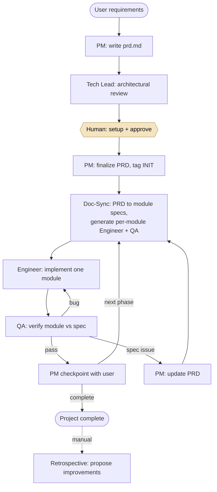

# Multi-Agent Software Development System

**A team of six AI agents that plan, build, and QA software through a controlled, human-approved workflow. The system shipped a deployed full-stack app, TabVault, from start to finish.**

**At a glance:** Sole architect · 6 specialized agents · Human-approved at every handoff · Shipped TabVault (live)

`Claude Code (subagents, skills, hooks)` · `Bash` · `Git`
[Built by the system: tab-vault.com](https://tab-vault.com) · [System repo](https://github.com/LeonWu813/multi-agent-software-development-system) · [TabVault repo](https://github.com/LeonWu813/tab-management)

---

## Architecture

*A human approval gate sits on every arrow. The hook proposes the next step; the human runs it.*

## The problem

After shipping a full-stack analytics platform end to end on my own, I kept running into the same limitation: a single AI coding agent tends to lose the plot on a real project. Context drifts over a long session, earlier decisions get quietly overwritten, and there is no clean way to review or undo a bad step. I wanted to understand whether the answer was a better prompt or a better system.

I decided it was the system. So I built one: a development team made up of specialized agents, each with a single job, coordinating the way real engineers do through documents, reviews, and version control, with a human in control at every step.

## My role

I was the sole architect and builder. I designed the agent roles, the information boundaries between them, the skill layer, and the git-backed handoff mechanism. I treated the design itself as the deliverable. I drafted the full architecture up front in a single design document, then hardened it by running real projects through the system and fixing whatever broke along the way.

## How it works, end to end

A project moves through the team like work moves through a real one. The PM agent gathers requirements and writes a product requirements document, which becomes the single source of truth. A Tech Lead agent reviews it for feasibility and risk and produces a setup runbook. After the human completes setup and approves, the PM finalizes the document. Doc-Sync then translates that one document into a separate, self-contained spec for each module, and generates a dedicated Engineer and QA agent per module. An Engineer agent implements a single module against its spec; a QA agent verifies that module against the same spec. If QA finds a bug it goes back to the Engineer; if it finds a problem with the spec itself it goes back to the PM, because that may require changing the requirements. When a module passes, the PM checks in with the human before the next one begins.

The crucial detail is that no step runs on its own. Each agent finishes by committing its work and recording what it did, and a hook then prints the exact command for the next step. The human reads it and decides whether to run it.

## Design principles

I started from the idea of an agent harness: the belief that the engineering around the model matters more than any single prompt. Four ideas do most of the work.

**Single responsibility.** Rather than one agent that does everything, there are six, each with one input, one output, and one handoff rule. Small, scoped agents are easier to constrain and to reason about, so a mistake stays contained instead of spreading.

**Least-privilege information boundaries.** Each agent can read and write only the files its role requires, which I encoded as an explicit write-access matrix. The Engineer, for example, never sees the requirements document; it sees only its own module spec, which carries forward just enough context. No agent sees everything. The trade-off is that information has to be carried forward deliberately, through Doc-Sync's translation step, rather than every agent reaching for whatever it wants. That adds a moving part, but it is what keeps each agent small enough to trust.

**A human in the loop at every handoff.** The system proposes the next action; the human approves before it runs. Nothing is applied without review.

**Git as a rollback safety net.** Every handoff is an atomic commit, so any step is a clean point to revert to. A progressive-disclosure skill layer, where lean router files load detailed workflows only when an agent needs them, keeps each agent's working context small and focused.

## The six agents

The team is PM, Doc-Sync, Tech Lead, Engineer, QA, and Retrospective. Each writes only to its own narrow set of files. The PM owns the requirements document and all communication with the human. Doc-Sync owns translation and the generated per-module agents. The Tech Lead is advisory and writes only reviews and the setup runbook. Engineers write source code; QA writes verification results; Retrospective writes only improvement proposals. The Engineer and QA roles are base templates, and Doc-Sync generates a thin wrapper of each per module that hard-codes exactly which spec and dependencies that instance is allowed to read. In effect the system writes part of itself, with least-privilege access built in from the start.

## Decisions worth calling out

**Doc-Sync is a translator, not an interpreter.** It is allowed to restructure and distribute the requirements document's content, never to add or infer anything. If the requirements are ambiguous, it does not guess; it leaves an explicit marker and logs the question for the PM to resolve. This keeps a single source of truth genuinely single, because no downstream document invents details the PM did not write.

**Synchronization is incremental and verified.** The first sync builds every downstream document; later syncs apply only the delta from a change, and a trivial wording change takes a lightweight path rather than a full re-sync. After a substantive sync, a script verifies the integrity of the result before the work is declared complete, so drift between the requirements and the specs is caught mechanically.

**The handoff hook informs but never acts.** A stop hook reads a machine-readable record of the last action and prints the precise next command, along with a warning if the finishing agent left uncommitted changes. It never invokes the next agent itself. The system's job is to remove guesswork from what comes next, not to take the human out of the loop.

**QA is honest about what it can and cannot verify.** Backend modules do not pass on code inspection alone; the QA agent has to start a real server, call real endpoints, and check actual database state. And because a browser UI genuinely cannot be verified from the command line, the front-end QA agent stops and produces a written test script for a human rather than falsely reporting a pass. Designing around the limits of automated verification, instead of pretending those limits do not exist, was a deliberate choice.

**The system improves itself, but only through a human.** A Retrospective agent, which runs only when explicitly invoked, reads the full project history and proposes changes to the agents and skills, with each proposal traced back to a specific incident. It never edits the agents or skills directly; a human reviews the proposals and applies the ones worth keeping.

## Impact

The system designed, implemented, and QA'd TabVault, a deployed full-stack tab and notes manager that is live in production. The agents built it while I reviewed and approved each handoff. The result is a workflow where failures stay contained to a single module instead of cascading, every step is reviewable and any step is cleanly reversible through git, and the whole process is transparent because coordination happens in plain files rather than hidden state.

That build also exercised the self-improvement loop for real. TabVault's deployment surfaced a series of cloud-only failures, and the Retrospective agent turned each one into a concrete, traceable proposal to strengthen the engineering and QA checklists, so the same class of mistake is caught automatically on the next project. The system did not just produce software; it got better from having done so.

## What I learned, and what I would improve

The hard part of a multi-agent system is not the code the agents write. It is the system that makes them produce correct software reliably. Most of my iterations went into tightening information boundaries and handoff rules, not into prompting. I also learned to design for the limits of automated verification rather than around them. The most trustworthy part of the system turned out to be the place where it admits a machine cannot check something and asks a person instead.

If I extended the project, I would add automated metrics on handoff success rates and time to ship across projects, so that improvements to the harness could be measured rather than judged by feel.
