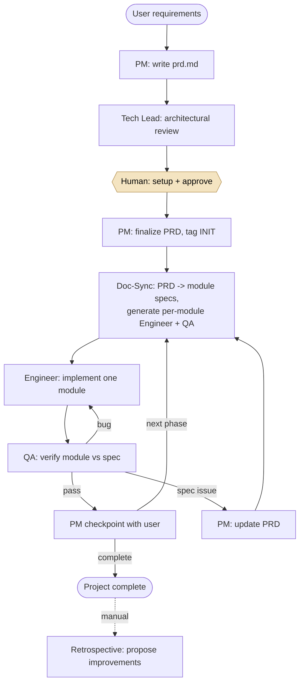

# Multi-Agent Software Development System

**A team of six AI agents that plan, build, and QA software through a controlled, human-approved workflow. The system shipped a deployed full-stack app, TabVault, from start to finish.**

**At a glance:** Sole architect · 6 specialized agents · Human-approved at every handoff · Shipped TabVault (live)

`Claude Code (subagents, skills, hooks)` · `Bash` · `Git`
[Built by the system: tab-vault.com](https://tab-vault.com) · [System repo](https://github.com/LeonWu813/multi-agent-software-development-system) · [TabVault repo](https://github.com/LeonWu813/tab-management)

---

## Architecture

*A human approval gate sits on every arrow — the hook proposes the next step; the human runs it.*

## The problem

After shipping a full-stack analytics platform end to end on my own, I kept running into the same limitation: a single AI coding agent tends to lose the plot on a real project. Context drifts over a long session, earlier decisions get quietly overwritten, and there is no clean way to review or undo a bad step. I wanted to understand whether the answer was a better prompt or a better system.

I decided it was the system. So I built one: a development team made up of specialized agents, each with a single job, coordinating the way real engineers do through documents, reviews, and version control, with a human in control at every step.

## My role

I was the sole architect and builder. I designed the agent roles, the information boundaries between them, the skill layer, and the git-backed handoff mechanism. I treated the design itself as the deliverable. I drafted the full architecture up front in `ARCHITECTURE.md`, then hardened it by running real projects through the system and fixing whatever broke along the way.

## Approach and key decisions

I started from the idea of an agent harness, the belief that the engineering around the model matters more than any single prompt. Four design decisions did most of the work.

**Single responsibility, enforced by information boundaries.** Rather than one agent that does everything, there are six: PM, Doc-Sync, Tech Lead, Engineer, QA, and Retrospective. Each has one input, one output, and one handoff rule. More importantly, each agent can only read and write the files its role actually needs. The Engineer, for instance, never sees the product requirements document; it sees only its own module spec. I encoded these permissions as an explicit write-access matrix, so a mistake in one agent stays contained instead of corrupting the whole project.

There was a clear trade-off here. Strict boundaries mean information has to be carried forward deliberately. A dedicated Doc-Sync agent translates the requirements document into per-module specs, rather than letting every agent reach for whatever it wants. That adds moving parts, but it is also what keeps each agent small enough to constrain and reason about.

**Coordination through files, not shared memory.** Every agent runs as a fully independent `claude --agent <name>` session with no shared context. They communicate the way a real team does, by writing to disk: a requirements document as the single source of truth, downstream module specs, and a machine-readable `status.md` that records the last action taken. This makes the whole workflow inspectable, with no hidden state.

**A human in the loop at every handoff.** A `Stop` hook reads the last action from `status.md` and prints the exact next command to run, such as `claude --agent qa-mod-auth`. It never runs that command automatically. The person reviews each step and decides whether to proceed. The system proposes; the human approves.

**Git as a rollback safety net.** Every agent commits its work before stopping, so every handoff becomes an atomic, revertible point. Paired with a progressive-disclosure skill layer, where lean router files load detailed workflows only when an agent needs them, this keeps each agent's context efficient while keeping every change reviewable and reversible.

One decision I am especially glad I made: Doc-Sync generates the Engineer and QA agents for each module at sync time, hard-coding into every generated agent exactly which spec and dependencies it is allowed to read. The system writes part of itself, with least-privilege access built in from the start.

I also chose to build honesty into QA rather than pretend that CLI tests are always enough. Backend modules do not pass on code inspection alone; QA has to start a real server, hit live endpoints, and check the actual database state. And because a React interface genuinely cannot be verified from the command line, the frontend QA agent stops and produces a written test script for a human instead of falsely reporting a pass. Designing around the limits of automated verification was part of the point.

## Impact

The system designed, implemented, and QA'd TabVault, a deployed full-stack tab and notes manager that is live in production. The agents built it while I reviewed and approved each handoff. The result is a development workflow where failures stay contained to a single module instead of cascading, every step is reviewable and any step is cleanly reversible through git, and the entire process is transparent because coordination happens in plain files rather than hidden state.

## What I learned

The hard part of a multi-agent system is not the code the agents write. It is the system that makes them produce correct software reliably. Most of my iterations went into tightening information boundaries and handoff rules, not into prompting. I also learned to design for the limits of automated verification rather than around them. The most trustworthy part of the system turned out to be the place where it admits a machine cannot check something and asks a person instead.

If I extended the project, I would add automated metrics on handoff success rates and time to ship across projects, so that improvements to the harness could be measured rather than judged by feel.
