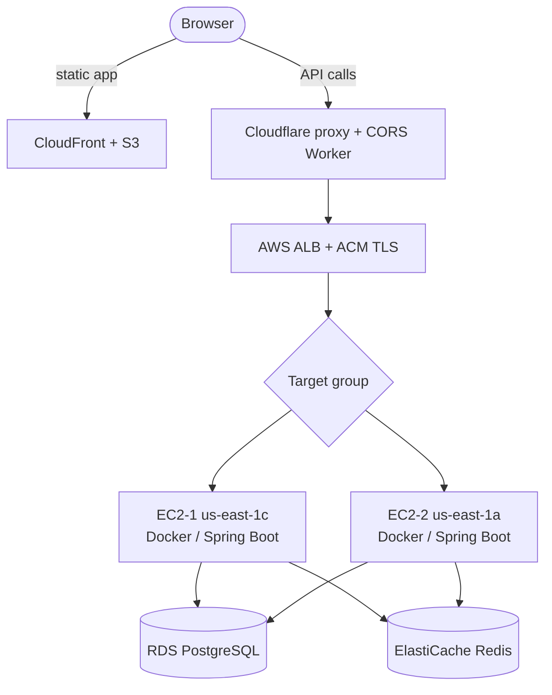

# SitePlus+

**A full-stack analytics platform for tracking user behavior, managing campaigns, and auditing SEO across multiple websites. Built end to end on my own and adopted in production by a real company, where it cut recurring analytics work by roughly 60 percent.**

**At a glance:** Sole engineer · Full-stack + AWS infra · Live in production · Cut recurring analytics work ~60%

`Java 21 / Spring Boot 3.4` · `React / TypeScript` · `Redux Toolkit` · `PostgreSQL` · `Redis` · `Docker` · `GitHub Actions` · `AWS (EC2, ALB, RDS, ElastiCache, S3, CloudFront)` · `Cloudflare`
[Live demo](https://www.siteplusplus.space) · [GitHub: marketing-analytics](https://github.com/LeonWu813/marketing-analytics)

---

## The problem

A small company I worked with was spending hours every week assembling the same marketing numbers by hand: page views, campaign performance, and a periodic SEO checkup. The data lived in several disconnected places, so every report meant repeating the same manual gathering. I set out to replace that routine with a single platform a site owner could install once and then rely on, covering behavior tracking, campaign management, and automated SEO auditing in one place.

I designed, built, and deployed the entire system myself, from the database schema to the production AWS infrastructure.

## My role

Sole engineer across the whole stack. I built the Spring Boot backend, the React and TypeScript front end, the JavaScript tracking snippet that customers paste into their sites, and the full AWS deployment with a continuous-delivery pipeline. Every design decision described below was mine to make and to own.

## How it works, end to end

The clearest way to understand the platform is to follow a single tracked event from a visitor's browser all the way to the owner's dashboard.

A site owner registers their website and receives an auto-generated tracking snippet, pre-filled with a unique site code, ready to paste into their page head. That snippet is a small self-contained script that captures page views, clicks, and form submissions and sends each one to a public ingest endpoint. The backend accepts the event without authentication (a browser visitor has no account), enriches it server-side with the visitor's country using a local geolocation database, and stores it against the owner's site. When the owner later opens their dashboard, the front end requests their analytics through an authenticated, ownership-checked endpoint, and the backend returns aggregates: events over time, top pages, channels, and countries, with period-over-period comparison. The same site can also be run through the SEO auditor, which crawls the page, calls an external PageSpeed service, and stores a report the owner can email or have re-checked automatically a week later.

That single path touches every interesting decision in the system: a public write with a private read, server-side enrichment, ownership scoping, and scheduled follow-up work.

## Architecture

The platform separates the static front end from the API so each can scale and deploy independently.



The front end is built with Vite, stored in S3, and served from CloudFront edge locations over HTTPS, with Origin Access Control so only CloudFront can read the bucket. API traffic passes through Cloudflare for DDoS protection and CORS handling, then an Application Load Balancer that terminates TLS and health-checks each instance every thirty seconds, then on to two EC2 instances running the Spring Boot app in Docker. Both instances share one RDS PostgreSQL database and one ElastiCache Redis node.

The data model is deliberately simple and is the backbone of the platform's security: every resource hangs off a Site, which belongs to a User.

```
User
└── Site
    ├── Campaign
    ├── Event
    └── SeoReport
        ├── SeoCheck
        └── ReportSendLog
```

Because everything is scoped to a Site, ownership is verified with a single lookup per request that finds the site by its code and the authenticated user. That one check protects every downstream resource, so there is no place where an authorization rule can be forgotten.

## Key engineering decisions

**Securing an endpoint that has to be public.** The tracking snippet runs in a visitor's browser with no credentials, so the event-ingest endpoint cannot require authentication. Rather than weaken security, I moved the guarantee to the read side: anyone can write an event, but only the authenticated site owner can read events back. To keep the open write path from being abused, I rate-limit it per IP so an attacker can be throttled but never mine the data. This split of a public write from a strictly private read is the heart of the design.

**Rate limiting that stays correct across multiple servers.** The platform runs on two instances behind a load balancer. An in-memory counter on each instance would have effectively doubled the real limit, since an attacker could alternate between them. I keep the counter in Redis instead, giving all instances one shared source of truth so the limit holds no matter which server answers a request. Reasoning about state across a distributed deployment, rather than a single box, was what made this correct.

**Stateless auth that made scaling free.** I chose JWTs over server-side sessions so any instance can validate a request on its own. The payoff was concrete: adding the second instance behind the load balancer required zero code changes, because there was no shared session store to coordinate.

**Choosing managed TLS over a self-managed certificate.** I terminate HTTPS at the load balancer with AWS Certificate Manager rather than running a web server with Let's Encrypt on each instance. The managed certificates renew silently, which removed a renewal cron job and the certificate compatibility issues I had hit with the self-managed approach. The load balancer also handles health checks and traffic distribution natively, so one component does three jobs.

**Locking the instances behind the load balancer.** The application port on each instance only accepts connections from the load balancer's security group, never the public internet. That makes the load balancer the single front door, so protections applied there cannot be bypassed by hitting a server directly.

**Data-safety choices that prevent silent corruption.** Two small decisions guard the data over time. Campaigns are soft-deleted rather than removed, because a hard delete would orphan every event that references them and destroy historical reporting. And the site code is immutable, because it is baked into every installed snippet; if it could change, every existing installation would break without warning. I also store enums by name rather than by ordinal position, so reordering a list of constants in code can never quietly remap existing rows.

**Resilience on purpose.** The two instances sit in different availability zones, so a single zone failure leaves the survivor serving all traffic automatically.

**Getting real work out of small hardware.** Running on t3.micro instances forced careful JVM tuning. I constrained the heap, metaspace, code cache, and thread stack size, and reduced the web server and database connection pools to fit comfortably alongside Docker and the auto-deploy agent inside one gigabyte of RAM. It taught me a lot about where a JVM actually spends memory.

**State that survives a restart.** The automated follow-up audits, which re-run an SEO check a week later and email the owner a comparison, store their pending work as fields in the database rather than in server memory. A scheduled job picks up whatever is due. Because the intent lives in PostgreSQL, a restart never loses a follow-up.

## Challenges and how I resolved them

**Preflight requests never reached the backend.** Putting Cloudflare in front of the API meant its proxy layer intercepted CORS preflight requests before they reached the load balancer, so the browser saw failures that did not correspond to anything in my application logs. I resolved it by writing a small Cloudflare Worker that answers preflight requests directly and appends the right headers to forwarded responses, which put CORS handling at the layer that was actually intercepting it.

**Preventing account enumeration at login.** A login form that says "wrong password" for a real email and "no such user" for a fake one quietly tells an attacker which emails are registered. I return the same error for both cases so the endpoint reveals nothing about which accounts exist.

## Impact

The platform was adopted in production by a real company and cut their recurring analytics work by roughly 60 percent, replacing hours of weekly manual reporting with a system that gathers, enriches, and visualizes the data on its own. It runs on a multi-AZ AWS deployment with a continuous-delivery pipeline that tests every change against a live PostgreSQL container, then builds and ships Docker images that the instances pick up and redeploy automatically within a few minutes, with no manual server access.

## What I learned, and what I would improve

Building and operating this alone taught me that the interesting problems live where the textbook stops. The clean answer says authenticate every endpoint, but a tracking snippet cannot carry a credential, so I had to put the security guarantee somewhere else. The clean answer says rate-limit requests, but the moment there are two servers, a naive counter is wrong. Working through those gaps end to end, and then keeping the result running in front of a real customer, is where I learned the most.

If I kept investing in it, the next steps I would prioritize are moving the per-minute rate limit to a sliding window for fairer throttling, replacing the five-minute polling redeploy with an event-driven trigger to shorten deploy time, and adding embedding-based search over saved analytics so owners can ask questions in plain language rather than only filtering.
